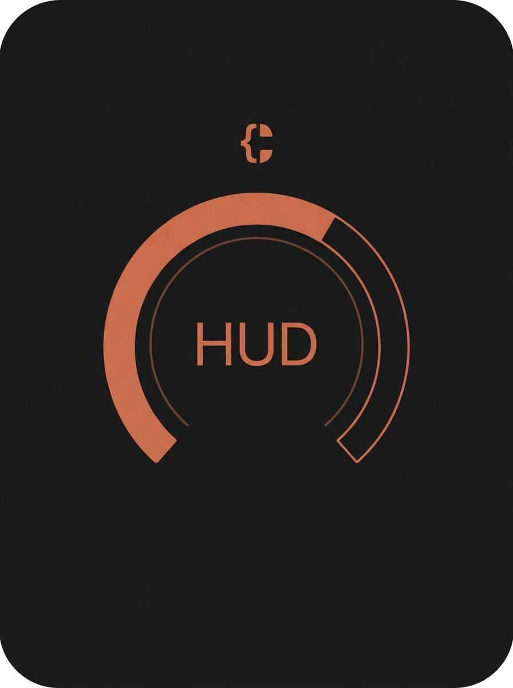

<div align="center">



# Claude Usage HUD

**Your Claude.ai usage, always visible in the macOS menu bar.**


</div>

Show your **Claude.ai session usage percentage** in the macOS menu bar at all
times — the same figure Claude shows in its own UI.

```
 ┌─────────────────────────────────────────────┐
 │  …  🔋  📶  🔊   62%   Tue 9:41              │   ← menu bar (green/orange/red)
 └─────────────────────────────────────────────┘
                      │ click
                      ▼
        ┌──────────────────────────────┐
        │        Claude Usage          │
        │  Current Session             │
        │  ████████████░░  62%         │   ← all usage buckets
        │  Resets in 1h 28m            │
        │  Weekly — All Models         │
        │  ██░░░░░░░░░░░░   6%          │
        │  Resets Wed 4:00 AM          │
        │  Weekly — Sonnet Only        │
        │  █░░░░░░░░░░░░░   2%          │
        │  Resets Wed 4:00 AM          │
        │  ───────────────────         │
        │  ☑ Launch at login           │
        │  Update key          Quit    │
        └──────────────────────────────┘
```

It's a single SwiftUI + AppKit menu bar app. You paste your claude.ai session
key once during setup; from then on the app polls Claude's usage API directly
every minute and colour-codes the current-session percentage in your menu bar.
**No browser extension, no local server — it just works in the background.**

```
claude-usage-hud/
├── MenuBarApp/                      ← Swift / SwiftUI Xcode project
│   ├── ClaudeUsageHUD.xcodeproj
│   └── ClaudeUsageHUD/
│       ├── ClaudeUsageHUDApp.swift      App entry point
│       ├── AppDelegate.swift            Status item + popover + polling loop
│       ├── ClaudeAPIClient.swift        Calls Claude's usage API with the cookie
│       ├── KeychainStore.swift          Stores the session key in the Keychain
│       ├── LoginItem.swift              Launch-at-login via SMAppService
│       ├── UsageState.swift             Shared observable state
│       ├── SetupView.swift              One-time "paste your session key" screen
│       ├── PopoverView.swift            SwiftUI popover (all usage buckets)
│       ├── Info.plist                   LSUIElement = true (no Dock icon)
│       └── Assets.xcassets              AppIcon + MenuBarIcon (template) + accent
├── icon.png                         ← source HUD gauge artwork
└── README.md
```

---

## How it works

1. On first launch the app shows a **setup window** asking for your claude.ai
   `sessionKey` cookie. You paste it once.
2. The key is saved in the **macOS Keychain** (encrypted at rest — never in a
   plist or in plain text).
3. The app calls `GET https://claude.ai/api/account` once to discover your
   organization id, then every **60 seconds** calls
   `GET https://claude.ai/api/organizations/{orgId}/usage` with the header
   `Cookie: sessionKey=<your key>`.
4. It parses each usage bucket from the response — the current 5-hour session,
   the weekly all-models limit, and the weekly Sonnet-only limit (each with its
   reset time).
5. The menu bar shows the current-session figure, e.g. `62%`, in **green**
   (`<50`), **orange** (`50–79`), or **red** (`≥80`).
6. Clicking the menu bar item opens a popover showing **all** of those buckets
   as colour-coded bars with their percentages and reset times — for example
   "Current Session 62% · Resets in 1h 28m", "Weekly — All Models 6% · Resets
   Wed 4:00 AM", "Weekly — Sonnet Only 2%".

### Launch at login

After your first successful setup the app **registers itself to launch at login**
automatically (via `SMAppService`, macOS 13+ — no LaunchAgent plist). You can
toggle this any time with the **Launch at login** checkbox in the popover footer;
the preference is remembered. Once it's a login item, the HUD is just always
there after you log in.

Nothing is sent anywhere except your own requests to `claude.ai`, exactly as
your browser would make them.

---

## Setup

**Requirements:** macOS 13+ and Xcode 15+ (no external dependencies).

### 1. Build and run the app

1. Open `MenuBarApp/ClaudeUsageHUD.xcodeproj` in Xcode.
2. Select the **ClaudeUsageHUD** scheme and **My Mac** as the run destination.
3. *(If Xcode complains about signing)* select the **ClaudeUsageHUD** target →
   **Signing & Capabilities** → set **Team** to your personal team, or leave it
   on automatic — macOS will sign it to run locally.
4. Press **⌘R**.

The app has **no Dock icon** (`LSUIElement = true`). On first run the setup
window appears automatically.

### 2. Paste your session key

In the setup window, follow the steps:

1. Open **claude.ai** in your browser.
2. Open DevTools (**⌥⌘I**).
3. Go to **Application → Cookies → claude.ai**.
4. Find the cookie named **`sessionKey`** and copy its value.
5. Paste it into the app and click **Save & Connect**.

The app validates the key by making one live request. On success the window
closes, the menu bar starts showing your usage, and the app registers itself to
**launch at login**. That's it — done forever (or until the cookie expires; see
below).

#### Run it without keeping Xcode open

After building once, the app is in Xcode's Products. Right-click
**`ClaudeUsageHUD.app`** in the Project navigator → **Show in Finder**, then copy
it to **`/Applications`** and launch it from there. Launch-at-login is enabled
automatically after setup (toggle it in the popover footer), so it'll come back
on its own after every reboot.

> Launch-at-login uses `SMAppService`, which registers the app at its current
> path — run the app from a stable location like `/Applications` rather than from
> Xcode's build folder so the login item keeps pointing at the right binary. You
> can review or remove it under **System Settings → General → Login Items**.

---

## Troubleshooting

**Menu bar shows `!` (red).**
Your session key was rejected — it has probably expired (claude.ai cookies
don't last forever). Click the menu bar item → **Update key…** and paste a fresh
`sessionKey` value.

**Menu bar shows `!` (orange).**
A transient network problem — the app couldn't reach claude.ai. It keeps
retrying every 30 seconds; click the item to see the error detail.

**Menu bar shows `—`.**
The app is running but no key is stored yet. Click the item → **Set up…**.

**A percentage looks wrong, or a weekly section is missing.**
Claude's internal API isn't a public contract, so its JSON shape can change. The
parser in `ClaudeAPIClient.swift` searches the response defensively for each
bucket (`sessionKeys`, `weeklyAllKeys`, `weeklySonnetKeys`). The current session
is required; the weekly sections only appear when a matching bucket is found, so
if a weekly row is missing the field name probably differs from the candidates.
Inspect the raw response by setting `DEBUG_DUMP = true` in `UsageParsing`
(`ClaudeAPIClient.swift`), watch Console.app for `[ClaudeUsageHUD]` log lines,
then add the real key names to the matching list.

**Requests fail with HTTP 403.**
claude.ai sits behind bot protection. The app sends a browser-like User-Agent,
but if you hit a challenge, refresh claude.ai in your browser and copy a current
`sessionKey` value again.

**Build fails on signing.**
For local use you don't need a paid Apple Developer account — set the target's
Team to your free personal team (or leave automatic) and Xcode will sign it to
run on your Mac.

---

## Icon

The HUD gauge artwork lives at [`icon.png`](icon.png). It's wired into the asset
catalog two ways:

- **`AppIcon`** — squared, full-bleed dark version used as the app/Dock icon
  (generated at all required macOS sizes, 16–1024 px).
- **`MenuBarIcon`** — an 18×18 pt **template** image (the gauge silhouette, with
  an @2x variant) that tints itself to match light/dark menu bars.

The menu bar itself shows the live percentage text; `MenuBarIcon` is available in
the catalog as the matching glyph.

---

## Privacy & security

- Your session key is stored in the **macOS Keychain**, encrypted at rest.
- The app talks **only** to `claude.ai`, using your own cookie — the same
  requests your browser already makes. Nothing is sent to any third party.
- No data is stored or transmitted anywhere else. The only thing read from the
  API is your usage percentage and reset time.
- Treat your `sessionKey` like a password: anyone with it can act as you on
  claude.ai. The app never displays it back or copies it elsewhere.
